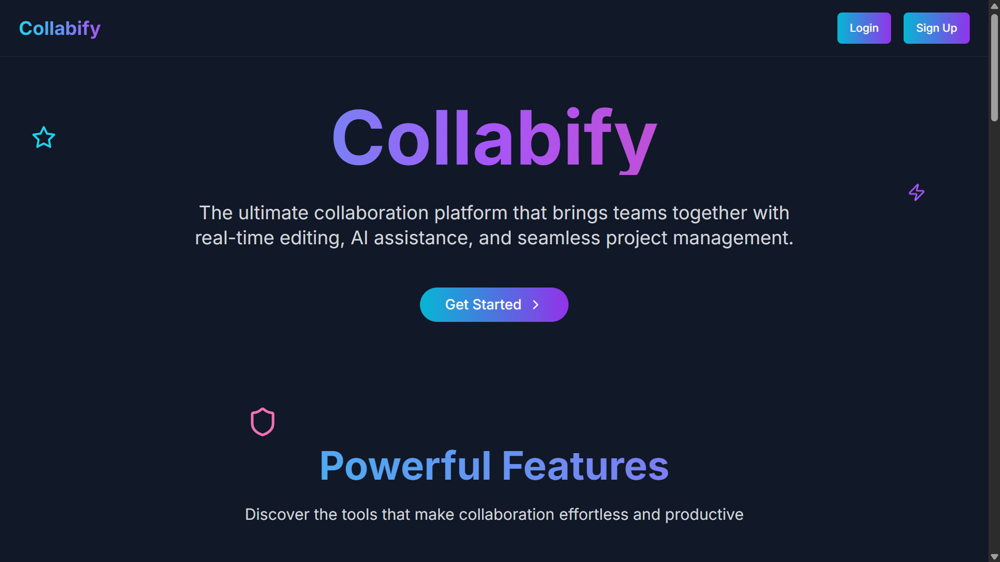

# [Collabify](collabify-site.vercel.app/)



> The ultimate collaboration platform that brings teams together with real-time editing, AI assistance, and seamless project management.

## Solution

Collabify is a comprehensive collaboration platform designed to transform how teams work together. Built for modern teams, it combines real-time document editing, AI-powered writing assistance, and intuitive project management in one seamless experience. Whether you're creating content, managing projects, or collaborating across time zones, Collabify provides the tools you need to work efficiently and stay connected.

## Features

- **Real-Time Collaboration** - Work together seamlessly with your team in real-time and see changes as they happen
- **AI Writing Assistant** - Enhance your writing with intelligent AI suggestions, grammar corrections, and content improvements
- **Shared Document Management** - Create, edit, and manage documents together with version control and access management
- **Team-Based Organization** - Structure your work efficiently with team-based project organization
- **Seamless Team Creation** - Build your collaborative workspace by creating teams or joining existing ones
- **Real-Time Notifications** - Stay updated with instant notifications for document changes and team activities
- **Cross-Platform Access** - Access your work from anywhere with responsive design and cloud synchronization
- **Secure Authentication** - Protected user authentication and authorization with role-based access control
- **Beautiful User Interface** - Clean, intuitive design that makes collaboration effortless
- **Document Version History** - Track changes and restore previous versions of your documents

## DB Diagram


## Tech Stack

### Backend

- **PostgreSQL** - Robust SQL database for storing documents, user data, and team information
- **Prisma** - Type-safe ORM for efficient database interactions and schema management
- **Redis** - In-memory database for real-time features and session management
- **Node.js** - JavaScript runtime for server-side development
- **Express** - Web framework for RESTful API development
- **Socket.io** - Real-time bidirectional event-based communication

- **AI Integration** - Advanced AI models for writing assistance and content suggestions
- **Zod** - Schema validation for API endpoints and data integrity

### Frontend

- **Next.js** - React framework for production-ready applications
- **TypeScript** - Type-safe JavaScript for better development experience
- **Tailwind CSS** - Utility-first CSS framework for responsive design
- **Socket.io Client** - Real-time communication with the backend
- **TipTap Text Editor** - Advanced text editing capabilities with collaborative features
- **Framer Motion** - Smooth animations and transitions

## Deployment

- **Vercel** - Deployment platform for frontend application
- **Render** - Deployment platform for backend services
- **Railway** - Redis and PostgreSQL

## Deployment Links

- Frontend: [Collabify](https://collabify-site.vercel.app)
- Backend: [API Server](https://collabify-backend.onrender.com)

### Installation

1. Clone the repository:

   ```bash
   git clone https://github.com/BadadheVed/Collabify.git
   ```

2. Navigate to the project directory:

   ```bash
   cd Collabify
   ```

### Running Frontend

1. Navigate to the frontend directory:

   ```bash
   cd frontend
   ```

2. Install dependencies:

   ```bash
   npm install
   ```

3. Create a `.env.local` file in the root directory and add your environment variables:

   ```env
   NEXT_PUBLIC_BACKEND_URL=<YOUR_BACKEND_URL>
   ```

4. Run the frontend:

   ```bash
   npm run dev
   ```

5. Open [http://localhost:3000](http://localhost:3000) in your browser to see the application.

### Running Backend Server

1. Create a `.env` file in the backend directory and add your environment variables:

   ```env
   JWT_SECRET=JET_SECRET
   PORT=5000
   FRONTEND_URL=FRONTEND_URL <http://localhost:3000/>
   DATABASE_URL="DB_URL"
   NODE_ENV=production
   REDIS_URL=REDIS_URL
   GEMINI_API=GEMINI_KEY
   ```

2. Navigate to the backend directory and start the server:

   ```bash
   cd backend
   npm install
   npx prisma generate
   npx prisma db push
   npm run build
   npm run start
   ```

3. Backend Server will run on endpoint: [http://localhost:5000](http://localhost:5000)

**Join the collaboration now with Collabify!** 🚀✨
